# SteelAI — 철강 시장 가격 예측 AI 시스템

> 다중 외부 경제 지표 자동 수집 + 머신러닝 기반 **방향 예측(UP/DOWN)** 및 **가격 수준 예측**  
> 예측 기간: **10일 · 30일 · 60일**

---

## 목차
1. [프로젝트 개요](#1-프로젝트-개요)
2. [기술 스택](#2-기술-스택)
3. [시스템 아키텍처](#3-시스템-아키텍처)
4. [웹 대시보드](#4-웹-대시보드)
5. [분석 과정 및 결과 해석](#5-분석-과정-및-결과-해석)
6. [ML 모델 성능 요약](#6-ml-모델-성능-요약)
7. [프로젝트 구조](#7-프로젝트-구조)
8. [실행 방법](#8-실행-방법)

---

## 1. 프로젝트 개요

국내 철강 유통 현물 단가를 예측하는 AI 시스템입니다.  
가격 데이터 외에도 **거시경제 지표, 해외 철강 시세, 금융 지수, 건설 수주** 등 80여 개 외부 피처를 자동으로 수집·가공하여 모델에 활용합니다.

> **⚠️ 피처 항목 비공개 안내**  
> 모델 학습에 사용된 세부 피처 항목(외부 경제 지표 종류, 수집 대상 데이터소스, 내부 물동량 컬럼명 등)은 **대외비로 공개되지 않습니다.**  
> 크롤러 구현 코드, 피처 목록 파일(`features_list.json`, `final_features.csv`), 분석 노트북(`.ipynb`) 및 원본 데이터는 이 저장소에 포함되어 있지 않습니다.

| 구분 | 내용 |
|------|------|
| 예측 대상 | 국내 철강 유통 현물 단가 |
| 예측 유형 | ① 가격 방향 (UP/DOWN) ② 가격 수준 (원/ton) |
| 예측 기간 | 10일 / 30일 / 60일 |
| 검증 방법 | Walk-Forward Validation (TimeSeriesSplit n=5) |
| 데이터 기간 | 2018년 ~ 2025년 (일별) |

---

## 2. 기술 스택

### Backend
- **Python Flask** — ML 예측 API 서버 (:5050)
- **Node.js + Express** — 프론트엔드 서빙 및 DB 조회 API (:8080)
- **MySQL** — 시계열 가격·피처 데이터 저장 (long format)
- **SQLAlchemy** — Python ↔ MySQL ORM

### Machine Learning
- **XGBoost** — 10일 방향 분류, 가격 회귀
- **LightGBM** — 60일 앙상블 구성
- **Logistic Regression** — 30일 / 60일 앙상블 구성
- **scikit-learn** — StandardScaler, TimeSeriesSplit, 평가 지표
- **joblib** — 모델 직렬화

### 데이터 수집
- **Selenium + webdriver-manager** — 로그인 기반 사이트 자동화
- **Requests + BeautifulSoup** — HTML 파싱
- **ECOS API** (한국은행) — 거시경제 지표
- **KOSIS API** (통계청) — 건설 수주, 생산지수 등

### Frontend
- **Bootstrap 4 (SB Admin 2)** + **Chart.js** + **jQuery**

### 분석 환경
- **Jupyter Notebook**, **pandas / numpy / matplotlib / seaborn / statsmodels**

---

## 3. 시스템 아키텍처

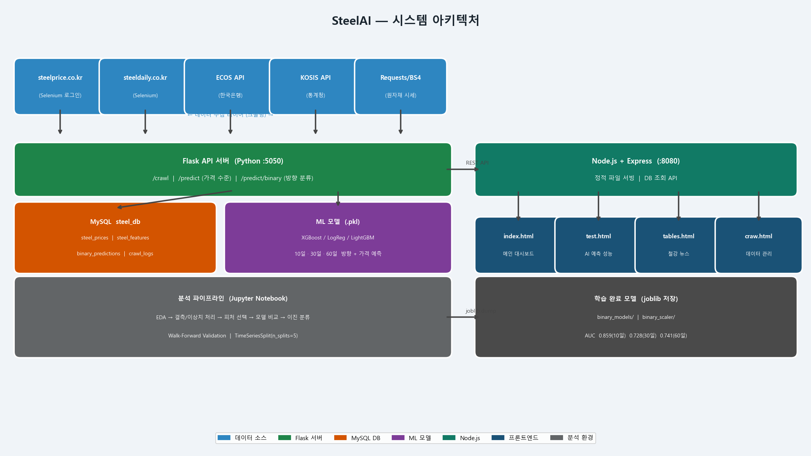

**데이터 흐름 요약**
```
외부 데이터 소스 (5종)
    ↓ Selenium / REST API / Requests
Flask 서버 (:5050)  →  MySQL steel_db  ←  ML 모델 (.pkl)
    ↓ REST API
Node.js 서버 (:8080)
    ↓
웹 대시보드 (index / test / tables / craw)
```

---

## 4. 웹 대시보드

> 서버 실행 후 `http://localhost:8080` 접속

| 페이지 | 설명 |
|--------|------|
| `index.html` | 최신 가격 차트, 10·30·60일 AI 예측 카드 (방향·확률·예상가격) |
| `test.html` | Walk-Forward 기준 모델별 성능(Accuracy, AUC) 차트 |
| `tables.html` | 실시간 철강 업계 뉴스 |
| `craw.html` | 외부 데이터 수집 실행·이력 관리 |

---

## 5. 분석 과정 및 결과 해석

### 5-1. 데이터 개요 — 가격 시계열

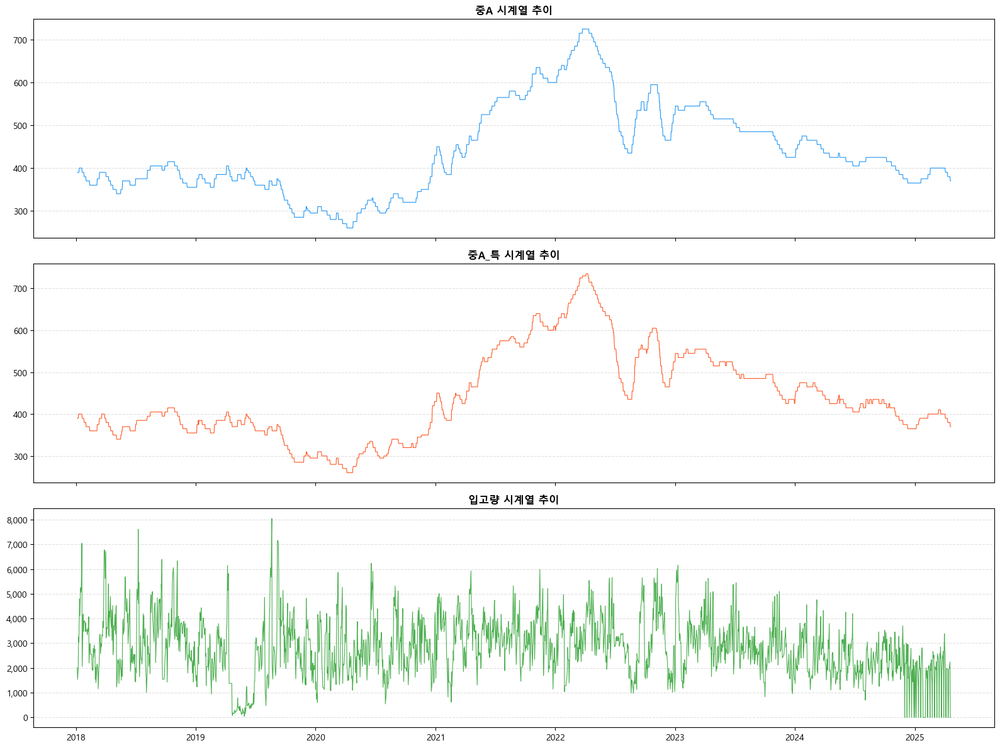

> **해석**: 분석 기간 동안 가격이 2021~2022년 급등 후 하락하는 등 강한 비선형·비정상성(non-stationarity)을 보였습니다.
> 단순 회귀로는 이런 구조 변화를 포착하기 어렵고, **여러 외부 지표와의 상관관계**를 함께 활용하는 앙상블 모델이 필요함을 확인했습니다.

---

### 5-2. 피처 가용성

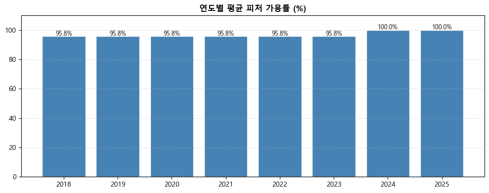

> **해석**: 연도별 피처 평균 가용률이 95.8%(2018~2023년)에서 2024년 이후 100%로 개선됐습니다.
> 일부 피처는 데이터 취득 시기가 늦어 초기 결측이 많았으며, 이를 보간(`.interpolate(method='time')`)으로 처리했습니다.

---

### 5-3. 결측 패턴

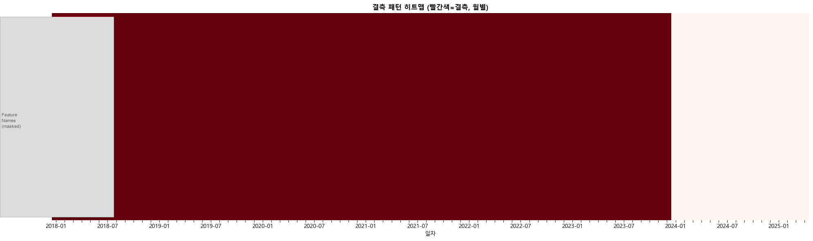

> **해석**: 특정 피처는 2023년 이전 전체 구간이 결측(빨간색)으로 표시됩니다.
> **결측률 ≥ 80% 피처는 자동 제외** 로직을 도입해 데이터가 없는 피처가 모델에 영향을 주지 않도록 처리했습니다.

---

### 5-4. 이상치 분포

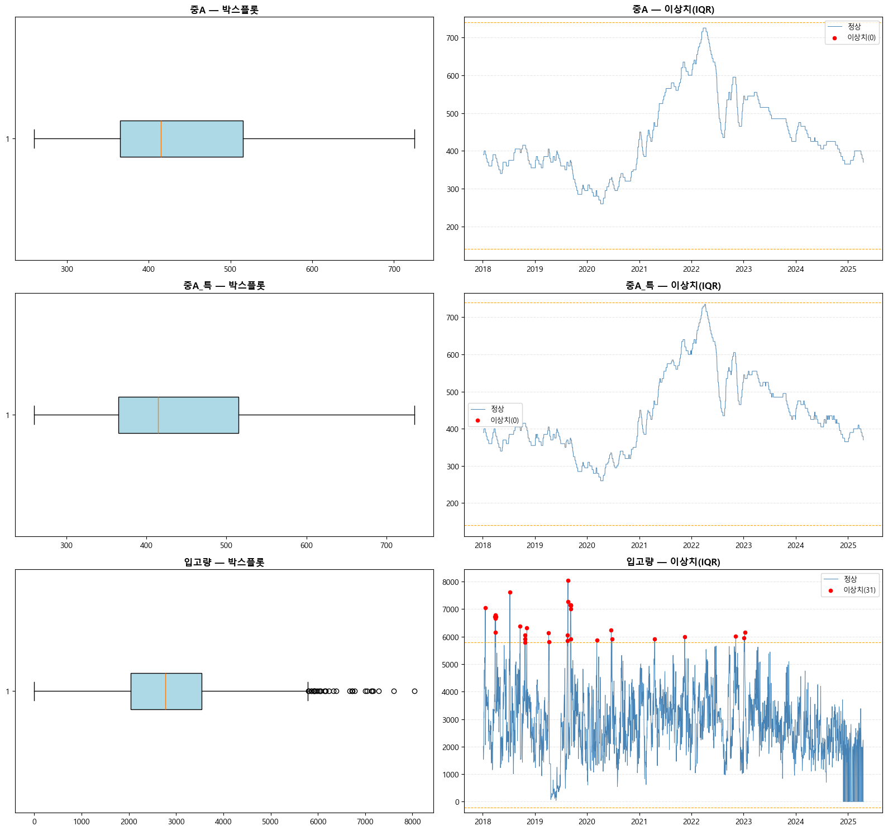

> **해석**: 2021~2022년 공급망 위기 당시 급등락이 이상치로 검출됐습니다.
> 철강 가격의 급등락은 **실제 시장 사건을 반영**하는 것이므로, 단순 제거보다 모델이 학습할 수 있도록 유지하되 로버스트한 트리 기반 모델을 선택했습니다.

---

### 5-5. 분포 분석

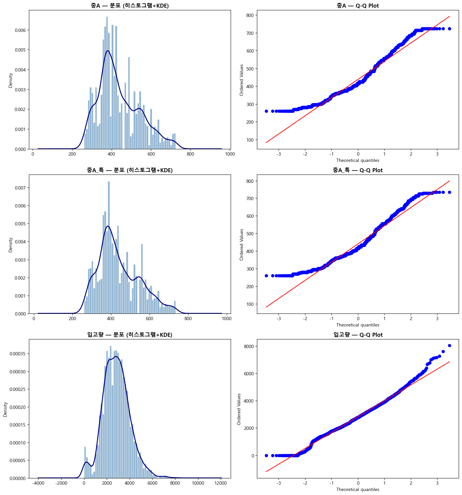

> **해석**: 가격 분포는 우편향(right-skewed)을 보입니다.
> 회귀 모델에서 로그 변환 여부를 검토했고, 방향 분류 모델은 분포 형태에 영향받지 않으므로 원본 스케일을 유지했습니다.

---

### 5-6. 계절성 및 시계열 분해

| STL 분해 | ACF/PACF | 계절 패턴 |
|----------|----------|-----------|
| 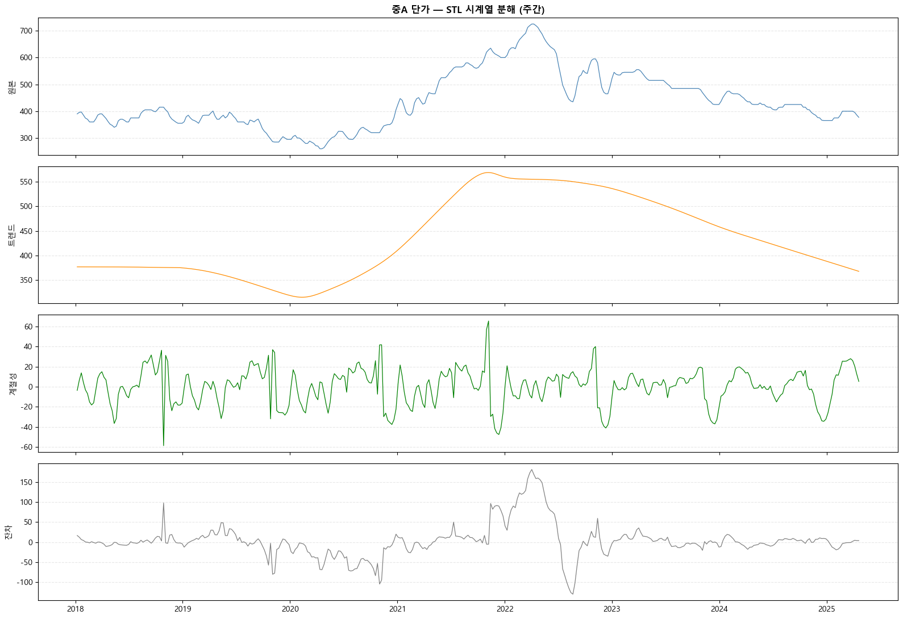 | 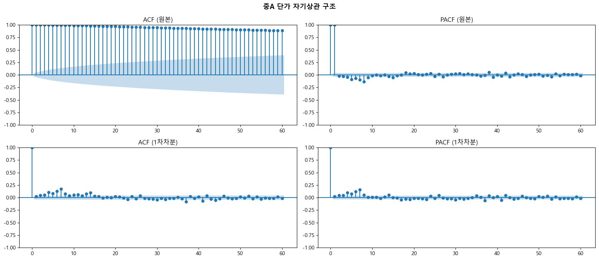 | 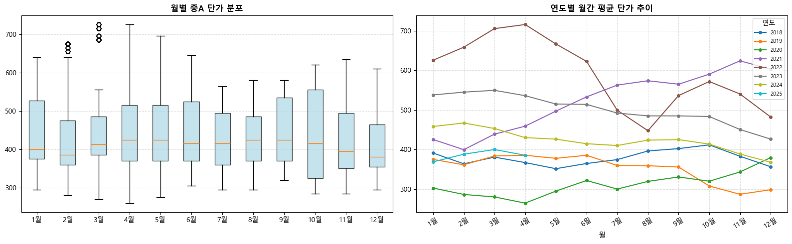 |

> **해석**:
> - **STL 분해**: 추세(Trend) 성분이 지배적이며 잔차(Residual)가 주기적으로 증가 → 외부 충격이 반복됨을 시사
> - **ACF/PACF**: 자기상관이 매우 높고 장기 지속 → lag 피처(1~30일)가 예측에 유효
> - **계절 패턴**: 뚜렷한 주기적 계절성보다 불규칙한 사이클이 반복 → 단순 ARIMA보다 ML 모델이 적합

---

### 5-7. 피처-타겟 상관관계

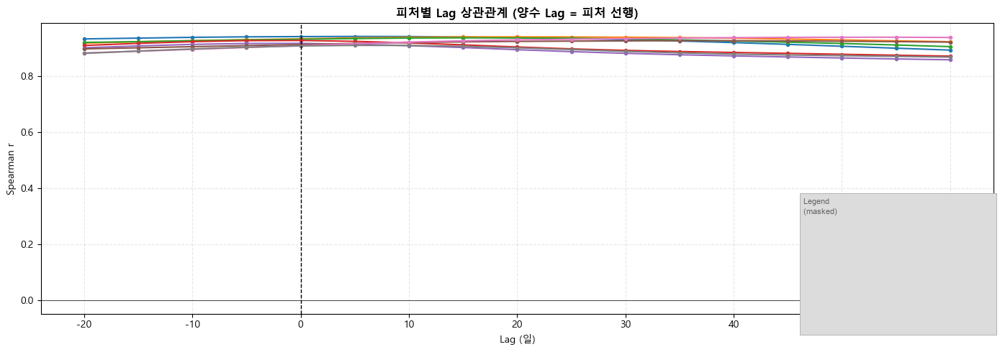

> **해석**: 상위 피처들의 Spearman 상관계수가 Lag 0~60에서 **0.85~0.95**로 매우 높습니다.
> 이는 해외 철강 시세 및 원자재 지표가 국내 가격과 강하게 동조됨을 의미하며, 피처 선택의 근거가 됐습니다.
> 단, 양수 Lag(과거 → 현재)와 음수 Lag(현재 → 미래)의 차이가 작아 **데이터 누수 방지를 위해 모든 피처에 shift(1) 적용**했습니다.

---

### 5-8. 상관관계 히트맵

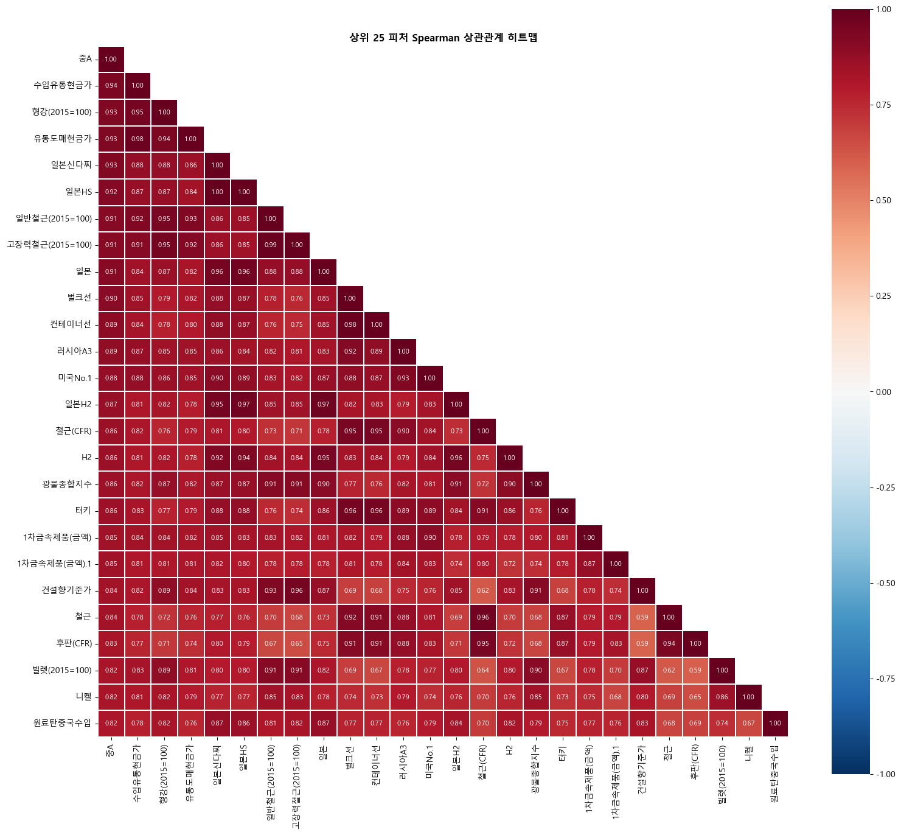

> **해석**: 상위 25개 피처 간 Spearman 상관관계가 대부분 0.70 이상으로 **다중공선성(multicollinearity)이 높습니다**.
> 이로 인해 선형 모델(Ridge, Lasso)에서 계수 불안정성이 발생했고, 상관관계에 강건한 **트리 기반 모델(XGBoost, LightGBM)이 우수한 성능**을 보였습니다.

---

### 5-9. 회귀 모델 비교 (가격 수준 예측)

| 모델 비교 | 예측 vs 실제 | R² 히트맵 |
|-----------|-------------|-----------|
| 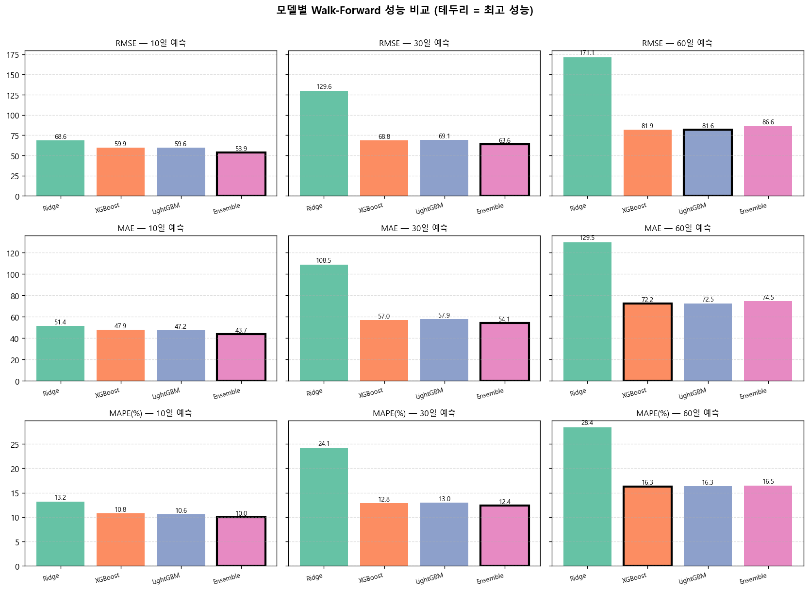 | 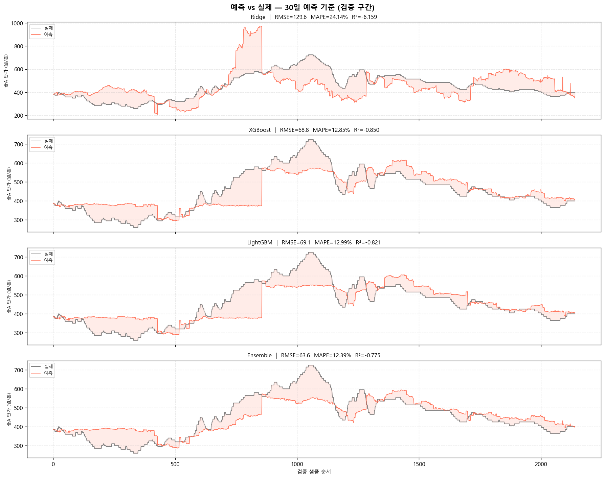 | 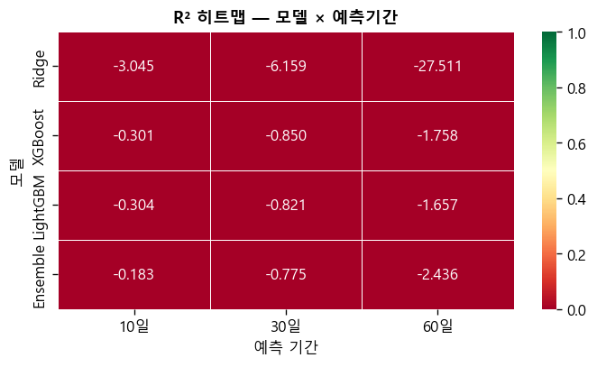 |

> **해석**:
> - R² 값이 전반적으로 음수 → 단순 가격 수준 예측(회귀)은 어렵고, **방향(등락) 예측**이 더 실용적임을 확인
> - XGBoost가 단기(10일)에서 가장 낮은 MAPE(10.75%)를 기록했지만, 장기(60일)로 갈수록 오차 급증
> - **→ 가격 수준 예측보다 방향 분류(이진)에 집중하는 방향으로 전환**

---

### 5-10. 피처 중요도 분석

| XGBoost 중요도 | LASSO 계수 | 상호정보량(MI) | 통합 앙상블 점수 |
|---------------|-----------|--------------|----------------|
| 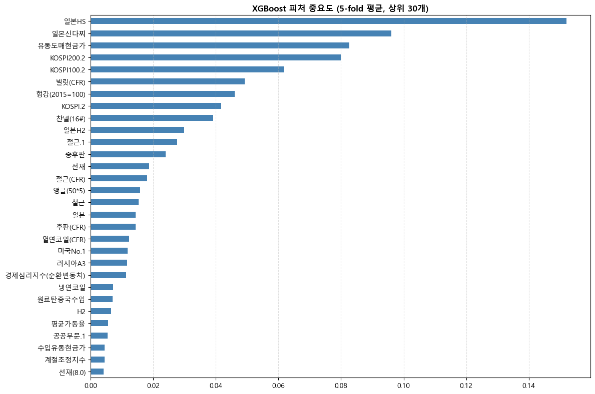 | 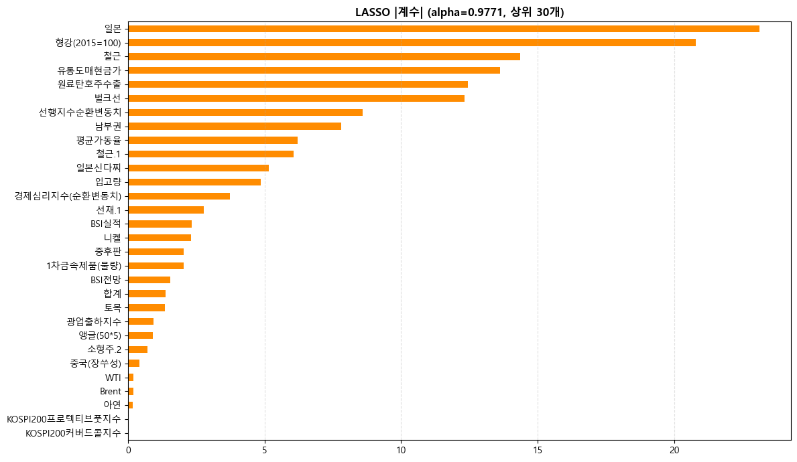 | 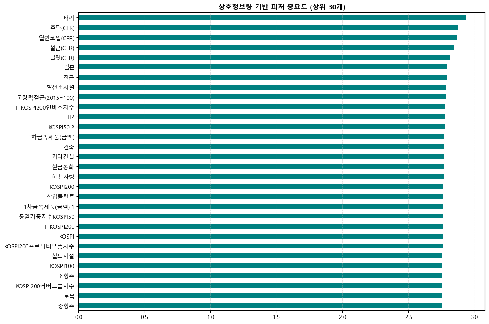 | 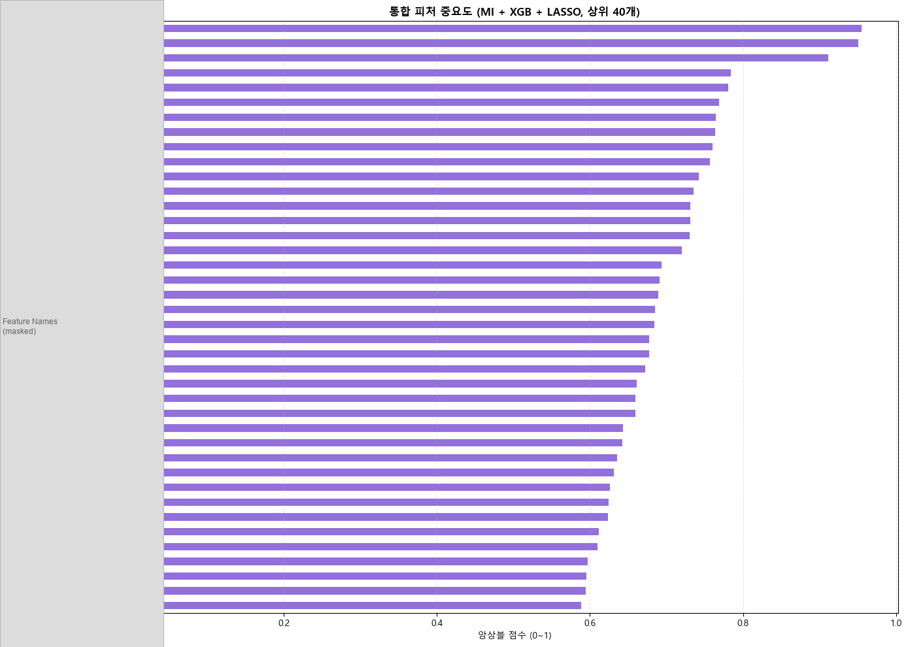 |

> **해석**:
> - 3가지 방법(XGBoost, LASSO, MI)의 중요도 점수를 **앙상블 합산**하여 최종 피처 순위를 결정
> - 해외 철강 시세 관련 피처들이 상위권 → 국내 가격은 해외 시황에 강하게 연동
> - 거시경제 지표(주가 지수, 경기심리지수) 중 일부도 유의미한 순위 → 경기 선행성 확인
> - **낮은 중요도 피처를 제거했을 때 XGBoost AUC가 0.859 → 0.663으로 급락** → 트리 모델은 낮은 중요도 피처도 상호작용에 활용함을 실험으로 확인. 최종적으로 전체 피처 유지.

---

### 5-11. 이진 분류 — 최종 성능 비교

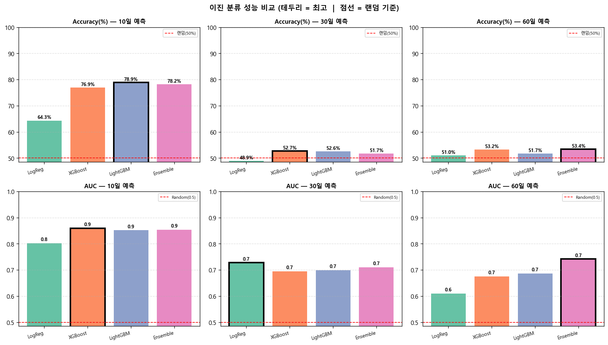

> **해석**:
> - **10일 예측**: XGBoost / LightGBM 모두 AUC 0.9, Accuracy 77~79% → 단기 패턴 학습에 트리 모델이 압도적
> - **30일 예측**: LogReg AUC 0.7로 XGBoost와 동등 → 중기는 선형 경계면이 충분히 효과적
> - **60일 예측**: Ensemble이 AUC 0.7로 단독 모델보다 미세하게 우수 → 장기 불확실성에서 모델 다양성이 도움
> - 점선(50%)과의 격차가 클수록 랜덤 대비 정보 우위 → 특히 10일 모델이 실용적 수준

---

### 5-12. 혼동 행렬 및 예측 타임라인

| 혼동 행렬 | 예측 타임라인 |
|-----------|-------------|
| 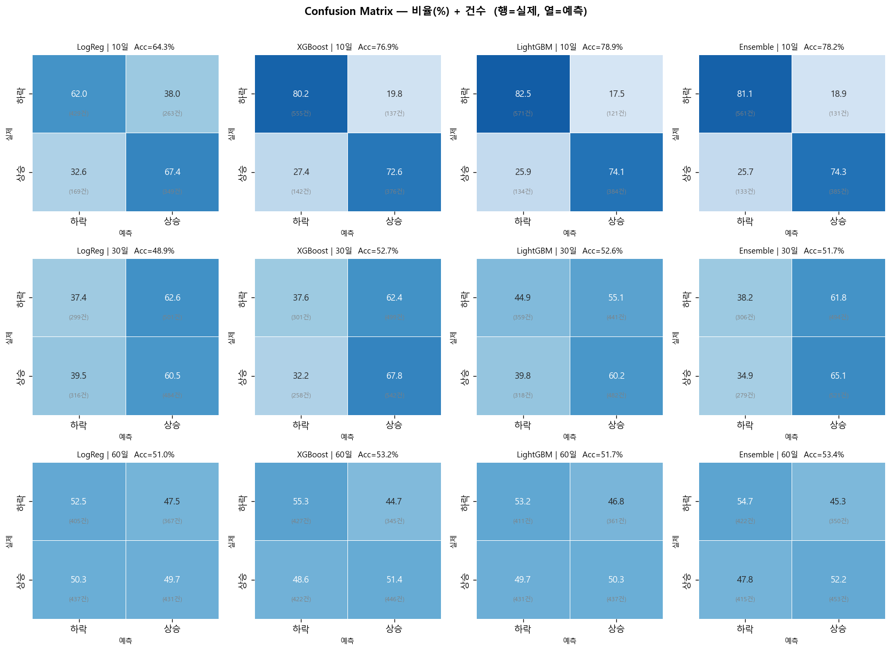 | 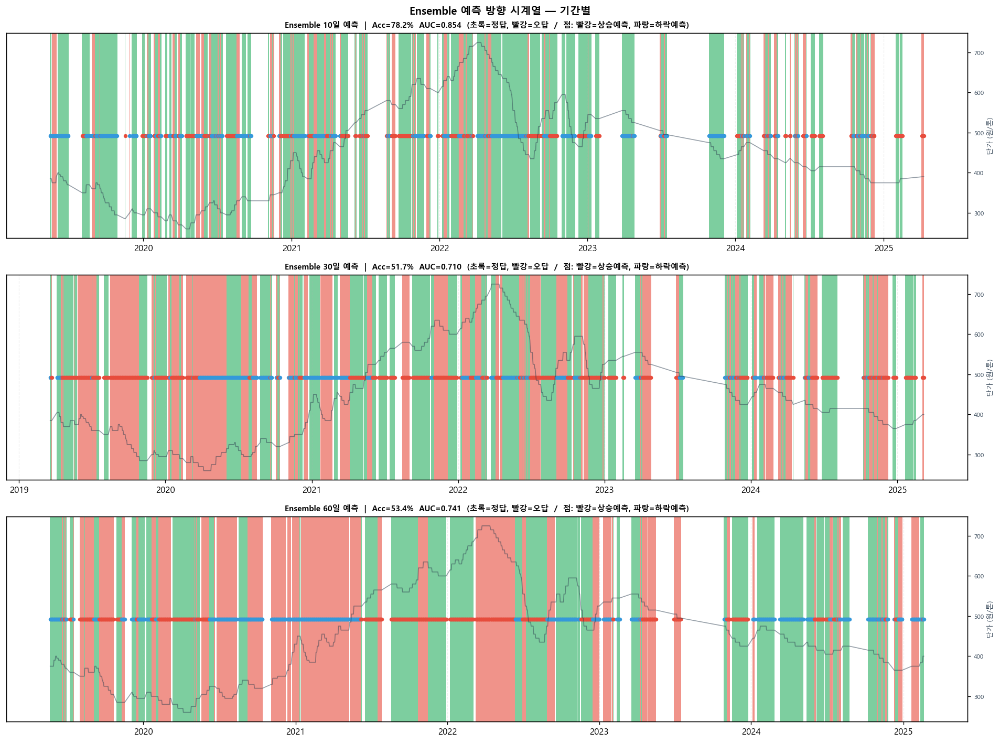 |

> **해석**:
> - **혼동 행렬**: 상승/하락 클래스 모두 균형 있게 예측 → `class_weight='balanced'` 적용 효과
> - **예측 타임라인**: 실제 방향 전환 구간에서 모델이 비교적 빠르게 신호를 포착
> - 2022년 급등락 구간에서 일부 오분류 발생 → 급격한 외생 충격(공급망 위기 등)은 한계

---

### 5-13. 이진 분류 피처 중요도 (10일 모델)

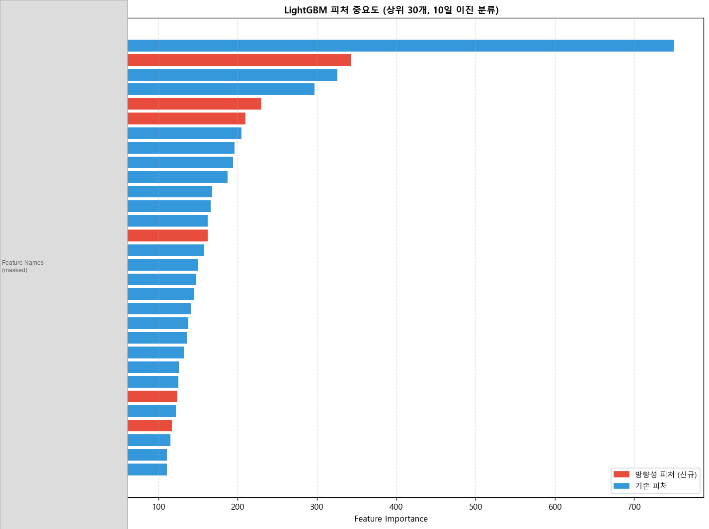

> **해석**:
> - 빨간 막대(방향성 피처): lag, rolling std, MA cross, return 등 **직접 계산한 기술적 지표**가 상위권
> - 파란 막대(외부 피처): 여러 외부 경제 지표가 방향 예측에도 유의미하게 기여
> - **→ 순수 기술적 분석 피처만으로는 한계, 외부 거시 데이터 통합이 성능 향상에 핵심**

---

## 6. ML 모델 성능 요약

### 방향 분류 (이진 분류) — Walk-Forward 검증

| 예측 기간 | 선택 모델 | Accuracy | AUC | 비고 |
|-----------|-----------|----------|-----|------|
| **10일** | XGBoost | **76.9%** | **0.859** | 최고 성능, 단기 패턴 포착 |
| **30일** | LogisticRegression | 64.3% | 0.728 | 선형 모델이 과적합 없이 안정적 |
| **60일** | Ensemble (LR+XGB+LGB) | 53.4% | 0.741 | 3모델 소프트 보팅 평균 |

### 가격 수준 예측 (회귀) — Walk-Forward 검증

| 예측 기간 | 모델 | RMSE | MAE | MAPE |
|-----------|------|------|-----|------|
| **10일** | XGBoost | 59.9 | 47.9 | **10.75%** |
| **30일** | XGBoost | 129.6 | 108.5 | 24.14% |
| **60일** | XGBoost | 171.1 | 129.5 | 28.38% |

> Walk-Forward Validation: `TimeSeriesSplit(n_splits=5)` — 미래 데이터를 학습에 사용하지 않는 시계열 전용 검증

---

## 7. 프로젝트 구조

```
steel/
├── analysis/                    # 분석 환경
│   ├── 01_data_overview.ipynb   # 데이터 탐색 (EDA)
│   ├── 02_missing_outlier.ipynb # 결측·이상치
│   ├── 03_distribution.ipynb   # 분포 분석
│   ├── 04_correlation.ipynb    # 상관관계
│   ├── 05_feature_selection.ipynb # 피처 선택
│   ├── 06_model_comparison.ipynb  # 모델 비교 (회귀)
│   ├── 07_classification.ipynb    # 다중 분류
│   ├── 08_binary_classification.ipynb # 이진 분류
│   ├── model_train_binary.py    # 최종 모델 학습 스크립트
│   ├── validate_binary.py       # Walk-Forward 성능 검증
│   ├── utils.py                 # 공통 데이터 로드
│   └── outputs/                 # 분석 결과 이미지
│
├── flask/                       # Flask API 서버
│   ├── app_test.py              # 메인 앱 (라우트)
│   ├── predict.py               # 가격 수준 예측 (회귀)
│   ├── predict_binary.py        # 방향 예측 (이진 분류)
│   ├── crawl.py                 # 크롤링 함수 (레거시)
│   ├── crawlers/                # 리팩토링된 크롤러 모듈
│   │   ├── base.py              # DB 엔진, retry, 자격증명
│   │   ├── ecos.py              # ECOS API (한국은행)
│   │   ├── kosis.py             # KOSIS API (통계청)
│   │   ├── steelprice.py        # 가격 크롤러 (Selenium)
│   │   ├── steeldaily.py        # 해외 시황 크롤러
│   │   └── misc.py              # 원자재 가격
│   └── .env.example             # 환경변수 템플릿
│
├── node/                        # Node.js 프론트엔드 서버
│   ├── server.js                # Express 서버
│   ├── .env.example             # 환경변수 템플릿
│   └── pubulic/                 # 정적 파일
│       ├── index.html           # 메인 대시보드
│       ├── test.html            # AI 예측 성능
│       ├── tables.html          # 뉴스
│       └── craw.html            # 데이터 관리
│
├── requirements.txt             # Python 의존성
└── PORTFOLIO_GUIDE.md           # 포트폴리오 상세 가이드
```

---

## 8. 실행 방법

### 환경 설정

```bash
# Python 의존성 설치
pip install -r requirements.txt

# Flask 환경변수 설정
cp flask/.env.example flask/.env
# .env 파일에서 DB 접속 정보 및 API 키 입력

# Node 환경변수 설정
cp node/.env.example node/.env
```

### 서버 실행

```bash
# 1. Flask API 서버 (포트 5050)
cd flask
python app_test.py

# 2. Node.js 서버 (포트 8080)
cd node
npm install
node server.js
```

### 모델 학습 (선택)

```bash
# 분석 → 최종 모델 재학습
cd analysis
python model_train_binary.py

# Walk-Forward 성능 검증
python validate_binary.py
```

### 브라우저 접속

```
http://localhost:8080         # 메인 대시보드
http://localhost:8080/test.html   # AI 성능 분석
```

---

## 환경변수 목록 (`.env`)

| 변수명 | 설명 |
|--------|------|
| `MYSQL_HOST` | MySQL 호스트 |
| `MYSQL_USER` | DB 사용자명 |
| `MYSQL_PASSWORD` | DB 비밀번호 |
| `ECOS_API_KEY` | 한국은행 ECOS API 키 |
| `KOSIS_API_KEY` | 통계청 KOSIS API 키 |
| `STEEL_PRICE_ID/PW` | steelprice.co.kr 계정 |
| `STEELDAILY_ID/PW` | steeldaily.co.kr 계정 |

---

<p align="center">
  <sub>SteelAI &copy; 2025 — Walk-Forward Validation 기준, 데이터 누수 없는 실운용 시뮬레이션</sub>
</p>
